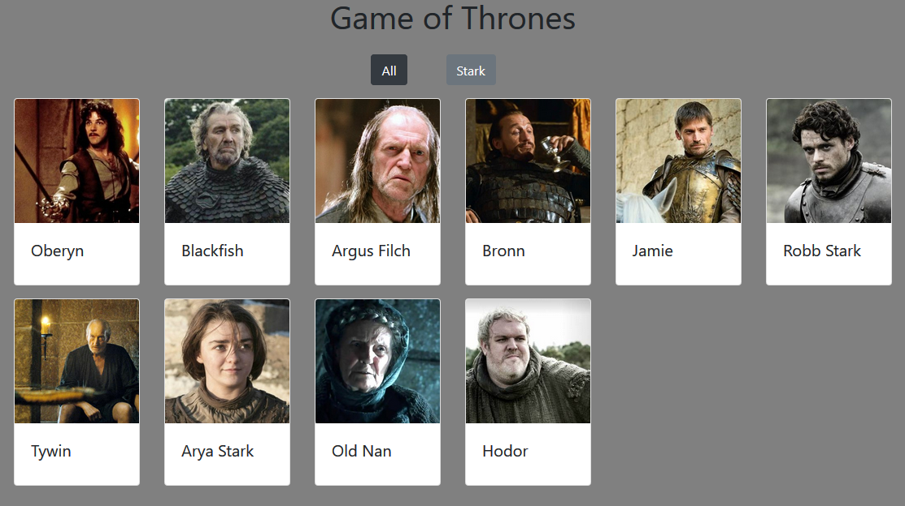
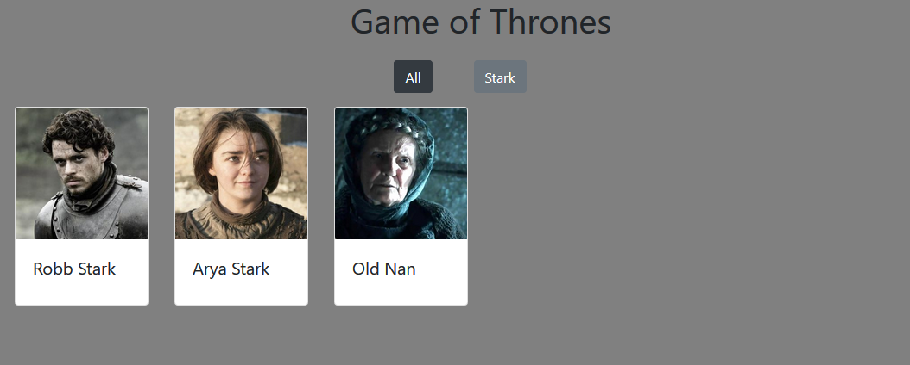

# Thrones

This was an in-class code-along project that displays a collection of cards for our favorite Game of Thrones characters. This in-class exercise exposed us to modular javascript, and introduced us to JSON, get method, 'this', filtering, and XMLHttpRequests to bring in data from JSON.

## Screenshots



## How to run this project
* Use npm to install http-server in your terminal:
```sh
npm install -g http-server
```
* Run the server in your terminal
```sh
hs -p 9999
```
* Open chrome and navigate to:
```
localhost: 9999
```
