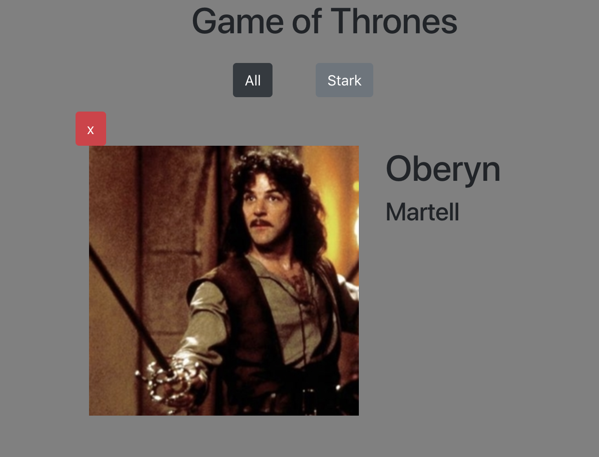

# Thrones

## Description
This app displays a small collection of Bootstrap cards based on popular Game of Thrones characters. The user has the option to filter characters associated with House Stark. The user can also click on an individual card to open an enlarged profile for that specific character.

This was an in-class code-along excercise that exposed us to modular javascript, and introduced us to JSON, get method, 'this', filtering, and XMLHttpRequests to bring in data from JSON.

## Screenshots




## How to run this project
* Clone this repository to your local machine.
* Use npm to install http-server in your terminal:
```sh
npm install -g http-server
```
* Run the server in your terminal
```sh
hs -p 9999
```
* Open chrome and navigate to:
```
localhost: 9999
```
